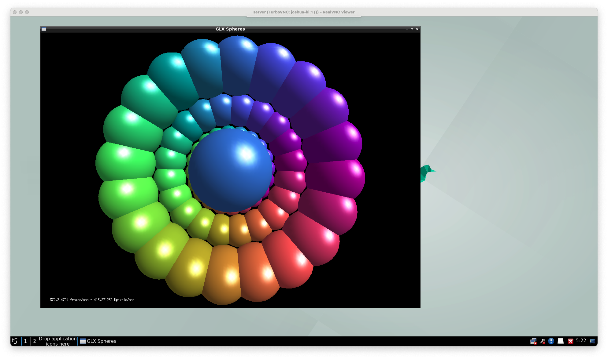

# VirtualGL and TurboVNC Docker image

Docker hub: [damanikjosh/virtualgl-turbovnc](https://hub.docker.com/r/damanikjosh/virtualgl-turbovnc)

This image is based on the [nvidia/opengl](https://hub.docker.com/r/nvidia/opengl) image and adds [VirtualGL](https://www.virtualgl.org/), [TurboVNC](https://www.turbovnc.org/), and [noVNC](https://novnc.com/info.html) to it. It is intended to be used as a base image for running graphical applications in a Docker container.

## Tags

- `latest`, `virtualgl3.1-ubuntu22.04`: Ubuntu 22.04 with VirtualGL 3.1 and TurboVNC 3.1
- `virtualgl3.1-ubuntu20.04`: Ubuntu 20.04 with VirtualGL 3.1 and TurboVNC 3.1

## Pre-requisites

In order to use this image, you need to have the NVIDIA drivers installed on the host system. You also need to have NVIDIA Container Toolkit installed on the host system. You can install it by following the instructions
[here](https://docs.nvidia.com/datacenter/cloud-native/container-toolkit/latest/install-guide.html).

Then, you need to install VirtualGL on the host system. To do this, you can follow the instructions below.

- Check the PCI bus ID of the GPU.
```bash
nvidia-xconfig --query-gpu-info
```

```
Number of GPUs: 1

GPU #0:
  Name      : NVIDIA GeForce RTX 3060 Ti
  UUID      : GPU-bee95cfa-fd98-c87d-894d-c2e16dc913af
  PCI BusID : PCI:1:0:0     <-- This is the PCI bus ID

  Number of Display Devices: 0
```

- Generate the `/etc/X11/xorg.conf` file.
```bash
nvidia-xconfig -a --allow-empty-initial-configuration --virtual=1920x1200 --busid PCI:1:0:0
```

```
Using X configuration file: "/etc/X11/xorg.conf".
Option "AllowEmptyInitialConfiguration" "True" added to Screen "Screen0".
Backed up file '/etc/X11/xorg.conf' as '/etc/X11/xorg.conf.backup'
New X configuration file written to '/etc/X11/xorg.conf'
```

- Shutdown the display manager.
```bash
# For GDM
sudo systemctl stop gdm
# For LightDM
sudo systemctl stop lightdm
```

- Install VirtualGL on host machine.
```bash
export VIRTUALGL_VERSION=3.1
wget -qO - https://sourceforge.net/projects/virtualgl/files/${VIRTUALGL_VERSION}/virtualgl_${VIRTUALGL_VERSION}_amd64.deb/download | sudo dpkg -i
```

- Configure VirtualGL server.
```bash
sudo /opt/VirtualGL/bin/vglserver_config
```
```
1) Configure server for use with VirtualGL (GLX + EGL back ends)
2) Unconfigure server for use with VirtualGL (GLX + EGL back ends)
3) Configure server for use with VirtualGL (EGL back end only)
4) Unconfigure server for use with VirtualGL (EGL back end only)
X) Exit

Choose:
1

WARNING: Configuring this server for use with VirtualGL will disable the
ability to log in locally with a Wayland session.

Continue?
[Y/n]


Restrict 3D X server access to vglusers group (recommended)?
[Y/n]
n

Restrict framebuffer device access to vglusers group (recommended)?
[Y/n]
n

Disable XTEST extension (recommended)?
[Y/n]

... Creating /etc/modprobe.d/virtualgl.conf to set requested permissions for
    /dev/nvidia* ...
... Attempting to remove nvidia module from memory so device permissions
    will be reloaded ...
modprobe: FATAL: Module nvidia_drm is in use.
... Granting write permission to /dev/nvidia-caps /dev/nvidia-modeset /dev/nvidia-uvm /dev/nvidia-uvm-tools /dev/nvidia0 /dev/nvidiactl for all users ...
... Granting write permission to /dev/dri/card0 for all users ...
... Granting write permission to /dev/dri/renderD128 for all users ...
... Modifying /etc/X11/xorg.conf.d/99-virtualgl-dri.conf to enable DRI
    permissions for all users ...
... Modifying /etc/X11/xorg.conf to enable DRI
    permissions for all users ...
... Adding xhost +LOCAL: to /etc/gdm3/Init/Default script ...
... Creating /usr/share/gdm/greeter/autostart/virtualgl.desktop ...
... Disabling Wayland in /etc/gdm3/custom.conf ...

Done. You must restart the display manager for the changes to take effect.

IMPORTANT NOTE: Your system uses modprobe.d to set device permissions.  You
must execute 'modprobe -r nvidia_uvm nvidia_drm nvidia_modeset nvidia' with the
display manager stopped in order for the new device permission settings to
become effective.
```

- Reboot the system.
```bash
sudo reboot
```

## Usage

You can use this image to run graphical applications in a Docker container. You can use the `vglrun` command to run the graphical applications using VirtualGL.

```bash
docker run --gpus all --rm -it --network=host -e DISPLAY=:1 damanikjosh/virtualgl-turbovnc:latest vglrun glxspheres64
```

```
Password: 
Verify:   
Would you like to enter a view-only password (y/n)? n
xauth:  file /root/.Xauthority does not exist

Desktop 'TurboVNC: joshua-ki:1 ()' started on display joshua-ki:1

Starting applications specified in /opt/TurboVNC/bin/xstartup.turbovnc
Log file is /root/.vnc/joshua-ki:1.log

Polygons in scene: 62464 (61 spheres * 1024 polys/spheres)
GLX FB config ID of window: 0xad (8/8/8/0)
Visual ID of window: 0x21
Context is Direct
OpenGL Renderer: NVIDIA GeForce RTX 3060 Ti/PCIe/SSE2
728.220730 frames/sec - 812.694335 Mpixels/sec
772.531431 frames/sec - 862.145077 Mpixels/sec
733.322725 frames/sec - 818.388161 Mpixels/sec
697.386022 frames/sec - 778.282801 Mpixels/sec
725.497405 frames/sec - 809.655104 Mpixels/sec

```

You  can customize the container using the following environment variables:
- `DISPLAY`: The display number to use for VNC. Default is `:10`.
- `VGL_DISPLAY`: The display number to use for VirtualGL. Default is `:0`.
- `VNC_PASSWORD`: The password for the VNC server. If not set, you will be prompted to enter a password when you run the container.
- `VNC_RESOLUTION`: The resolution of the VNC server. Default is `1280x800`.
- `NOVNC_PORT`: The port on which the noVNC server will listen. Default is `8080`.

To access the VNC server, you can use a VNC client to connect to `localhost:$((5900 + DISPLAY))`. You can also use a web browser to access the noVNC server at `http://localhost:${NOVNC_PORT}`.

[](screenshot.png)

## License

This image is licensed under the [MIT License](LICENSE).